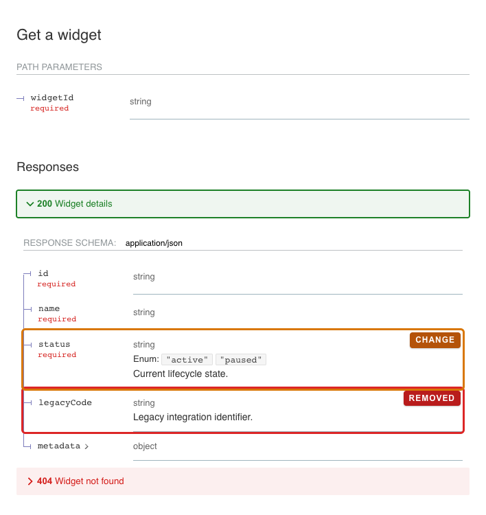
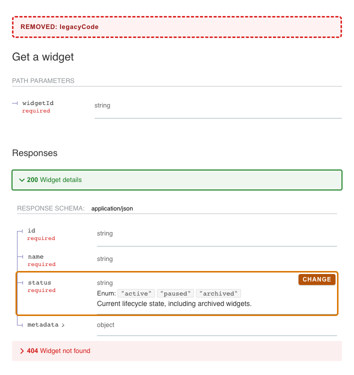

# aburasashi

[English](README.md) | [日本語](README.ja.md)


A collection of Agent Skills for reducing friction, exposing bottlenecks, and
making everyday software development more efficient.

The repository publishes the same skill implementations to both Claude Code and
Codex. Skills live only in `plugins/aburasashi/skills/`; platform-specific
manifests contain distribution metadata rather than duplicated instructions.

## Installation

Install and sign in to at least one supported host before installing
Aburasashi:

- [Codex CLI](https://developers.openai.com/codex/cli)
- [Claude Code](https://code.claude.com/docs/en/quickstart)

### Codex

```bash
codex plugin marketplace add axshia/aburasashi
codex plugin add aburasashi@aburasashi
```

### Claude Code

```bash
claude plugin marketplace add axshia/aburasashi
claude plugin install aburasashi@aburasashi
```

Start a new Codex or Claude Code session after installation so the newly
installed skills are loaded.

## Skills

- [Japanese PR Writing](plugins/aburasashi/skills/japanese-pr-writing/README.md)
  drafts and improves Japanese pull request copy while preserving technical
  meaning, validation status, and existing Markdown structure.
- [Web Design from References](plugins/aburasashi/skills/web-design-from-references/README.md)
  creates website section mockups from both a brand-concept image and a readable
  content-wireframe image, with shared art direction and targeted corrections;
  it does not generate images when either input is missing.
- [Figma iOS Simulator Parity](plugins/aburasashi/skills/figma-ios-simulator-parity/README.md)
  verifies and corrects a SwiftUI or UIKit screen against an exact Figma node
  on a pinned iOS Simulator, while preserving native controls, safe areas,
  Dynamic Type, and platform behavior.
- [Figma Web Parity](plugins/aburasashi/skills/figma-web-parity/README.md)
  verifies and corrects an in-progress web implementation against an exact,
  accessible Figma node using normalized captures and root-cause-driven visual
  diffs; it does not run when Figma design data is unavailable.
- [OpenAPI ReDoc PR Screenshots](plugins/aburasashi/skills/openapi-redoc-pr-screenshots/README.md)
  detects changed OpenAPI endpoints, creates annotated headless ReDoc captures,
  and prepares per-endpoint Before/After tables for GitHub pull requests.
- [Playwright PR QA](plugins/aburasashi/skills/playwright-pr-qa/README.md)
  runs owner-approved multi-user web QA, captures labeled desktop and mobile
  evidence, and publishes append-only checkpoint results to Draft pull requests.

### Example: modified endpoint

| Before | After |
| --- | --- |
|  |  |

See the [skill README](plugins/aburasashi/skills/openapi-redoc-pr-screenshots/README.md)
for added and removed endpoint examples, installation behavior, and usage.

## Repository layout

```text
.
├── .agents/plugins/marketplace.json       # Codex repo marketplace
├── .claude-plugin/marketplace.json        # Claude Code marketplace
├── plugins/aburasashi/
│   ├── .codex-plugin/plugin.json          # Codex/OpenAI manifest
│   ├── .claude-plugin/plugin.json         # Claude Code manifest
│   └── skills/                            # shared skill implementation
├── scripts/validate.py                    # dependency-free validation
└── docs/publishing.md                     # test and release procedure
```

## Development

Development requires Python 3.10 or later and `make`.

```bash
make validate
```

If the Claude Code CLI is installed, run its official validator as well:

```bash
make validate-claude
```

See [CONTRIBUTING.md](CONTRIBUTING.md) for skill authoring rules and
[docs/publishing.md](docs/publishing.md) for local installation and release
procedures.

## Design principles

- Share one skill implementation between Claude Code and Codex.
- Use provider-specific behavior only when the provider capability is required.
- Keep scripts deterministic and make side effects and permissions explicit.
- Compose focused skills to limit context use and maintenance cost.
- Continuously validate manifests, versions, and release requirements in CI.

## License

[MIT](LICENSE)
