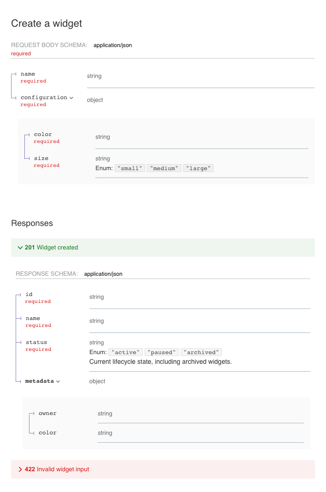
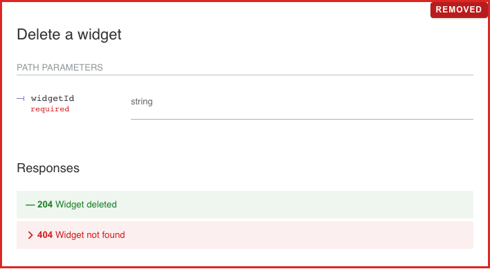

# OpenAPI ReDoc PR Screenshots

[Back to aburasashi](../../../../README.md)

Generate consistent, headless ReDoc comparisons for OpenAPI changes and prepare
the Markdown needed to publish them in a GitHub pull request.

## What it does

- Detects added, modified, and removed endpoints by HTTP method and path.
- Produces one Before/After table and one image pair per changed endpoint.
- Expands every request and non-error response property for new endpoints.
- Keeps unrelated property accordions closed for focused diffs.
- Outlines modifications with `CHANGE` and removals with `REMOVED`.
- Uses `EMPTY` and `EMPTY REMOVED` for intentionally missing table cells.
- Installs pinned Redocly CLI and Playwright packages into an external cache, so
  neither package needs to be installed in the target repository.

## Run it

```bash
./scripts/redoc-pr-visuals.sh \
  --before /absolute/path/to/before.yaml \
  --after /absolute/path/to/after.yaml \
  --output-dir /absolute/path/to/openapi-pr-visuals
```

Run the command from this skill directory, or invoke the script by its full
path. The helper prefers an installed Google Chrome executable and otherwise
installs a cached Playwright Chromium build. Both paths run headlessly.

The output directory contains:

- `capture-plan.json`, the detected endpoint and property changes.
- `pr-section.md`, a separate PR section and comparison table per endpoint.
- One PNG for every non-empty Before or After cell.

Use `--plan-only` to inspect the diff without rendering images. Repeat
`--endpoint "METHOD /path"` to restrict output to selected endpoints.

## Example

The example compares [before.yaml](assets/example/before.yaml) with
[after.yaml](assets/example/after.yaml). Its generated
[capture plan](assets/example/captures/capture-plan.json) and
[PR Markdown](assets/example/captures/pr-section.md) are checked in with the
sample images below.

### Modified endpoint: `GET /widgets/{widgetId}`

The changed `status` property is highlighted with `CHANGE`, while the original
`legacyCode` row and the After marker use `REMOVED`. The unrelated `metadata`
object remains collapsed.

| Before | After |
| --- | --- |
|  |  |

### Added endpoint: `POST /widgets`

The request and successful response objects are expanded, including their nested
properties. The error response remains closed.

| Before | After |
| --- | --- |
| **EMPTY** |  |

### Removed endpoint: `DELETE /widgets/{widgetId}`

The original operation is marked in place. The missing After cell states that
the endpoint was removed.

| Before | After |
| --- | --- |
|  | **EMPTY REMOVED** |

## Publish to a pull request

Upload the generated images through the GitHub pull request editor so GitHub
creates `user-attachments` URLs. Replace the `{{UPLOAD:file.png}}` placeholders
in `pr-section.md`, add the sections to the pull request body, and reopen the
pull request to verify that every image renders. Do not commit screenshots that
exist only as pull request evidence.
